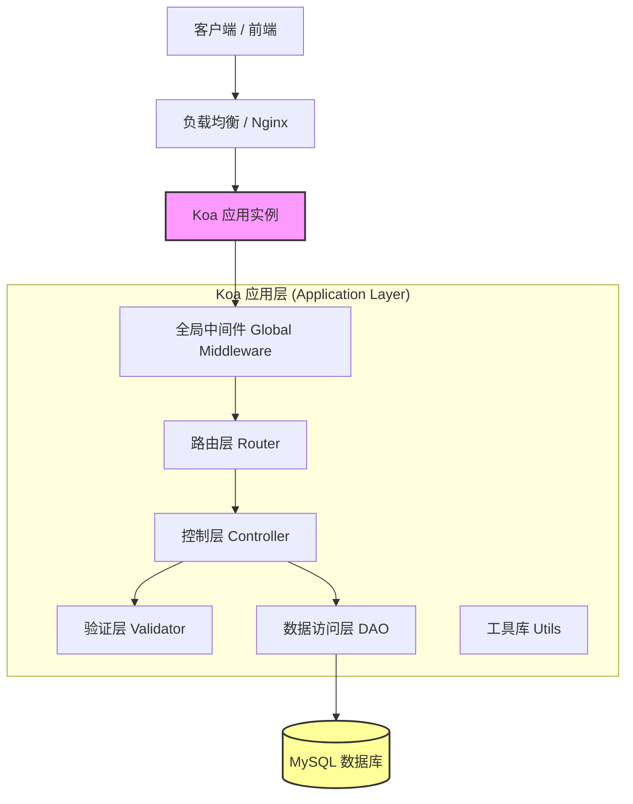
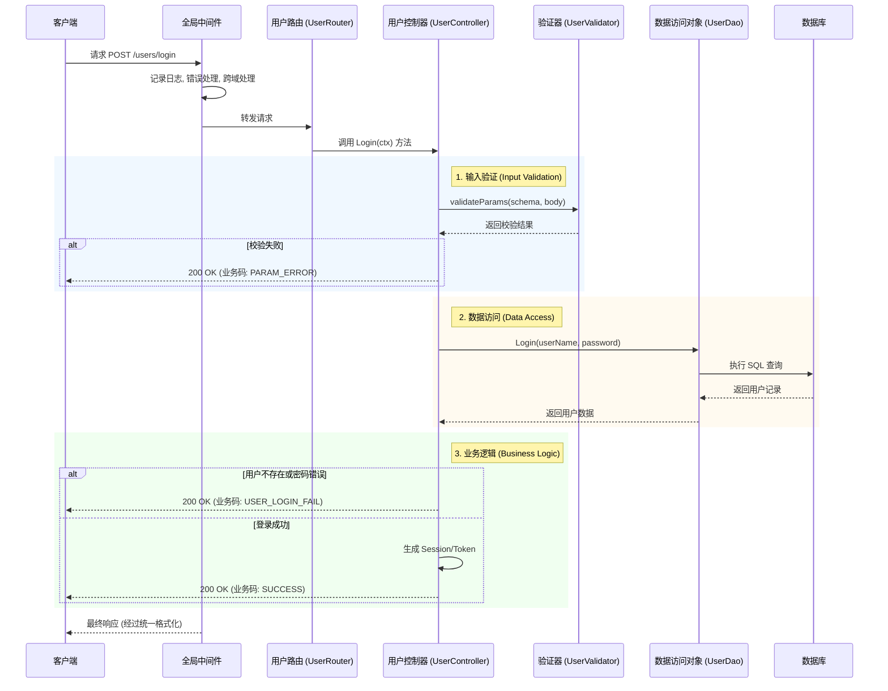

# 项目架构与技术栈说明

## 1. 技术栈概览 (Technology Stack)

- **核心框架**: Koa2
- **开发语言**: Node.js (ES Modules, 使用 Babel 编译)
- **数据库**: MySQL (通过 `mysql2` 驱动和 `knex` 构建器)
- **进程管理**: PM2 (支持集群模式 Cluster Mode)
- **日志系统**: Pino / Pino-Http
- **参数校验**: Joi
- **接口文档**: Swagger / OpenAPI
- **部署配置**: Ecosystem / PM2

## 2. 系统架构设计 (System Architecture)

本项目采用经典的分层 MVC (Model-View-Controller) 架构，专为 API 服务优化。通过严格的职责分离，确保代码的可维护性和扩展性。

## 3. MVC 详细逻辑流程 (MVC Logic Flow)

以下时序图展示了请求处理的核心流程，详细描绘了 **Controller (控制层)** 如何作为调度中心，协调验证逻辑、业务逻辑和数据访问。

### 示例场景：用户登录 (`POST /users/login`)

## 4. 各层职责详解 (Layer Responsibilities)

### 4.1 全局中间件 (`src/middleware`)
- **Logger**: 记录所有 HTTP 请求和响应时间。
- **Error Handler**: 全局 try-catch 捕获未处理的异常，防止服务崩溃。
- **CORS**: 处理跨域资源共享配置。
- **Response Formatter**: 统一 JSON 响应格式 (如 `{ code, msg, data }`)。

### 4.2 路由层 (`src/routers`)
- **职责**: 将 HTTP 路由 (URL + Method) 映射到具体的 Controller 函数。
- **文件示例**: `src/routers/router/usersRouter.js`
- **特点**: 纯粹的路由分发，不包含业务逻辑。

### 4.3 控制层 (`src/controllers`)
- **职责**: 应用的大脑，核心调度者。
- **逻辑流程**:
  1. 从 `ctx.request.body` 提取数据。
  2. 调用 **Validator** 校验数据完整性。
  3. 调用 **DAO** 进行数据查询或持久化。
  4. 根据结果决定 **业务状态码 (Business Code)** (如 `SUCCESS`, `USER_NOT_FOUND`)。
  5. 设置 `ctx.body` 返回结果。

### 4.4 验证层 (`src/validators`)
- **职责**: 定义数据模型 (Schema) 和验证规则。
- **工具**: Joi。
- **优势**: 将冗长的验证逻辑从 Controller 中剥离，保持代码整洁。

### 4.5 数据访问层 (`src/models/dao`)
- **职责**: 直接与数据库交互。
- **逻辑**: 编写和执行 SQL 语句。
- **抽象**: 隔离 Controller 与 SQL 细节，方便未来更换数据库或 ORM。

### 4.6 配置层 (`src/config`)
- **httpError.js**: 定义标准的 HTTP 状态码。
- **businessCode.js**: 定义业务逻辑状态码 (如 10001 代表用户错误，0 代表成功)。
